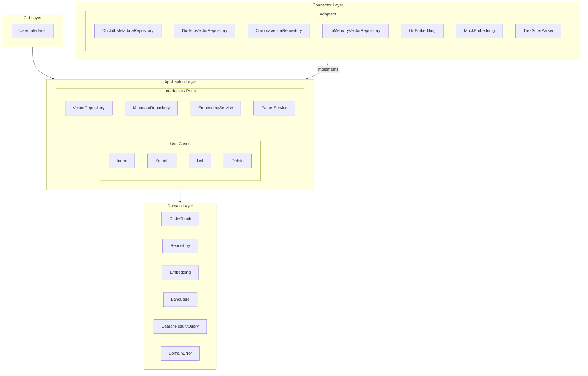
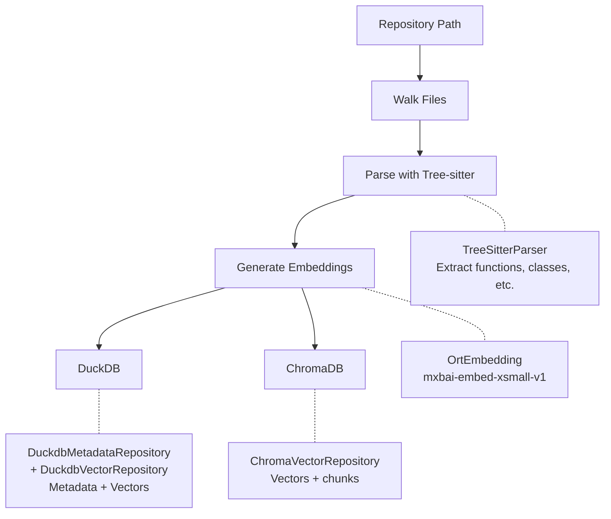
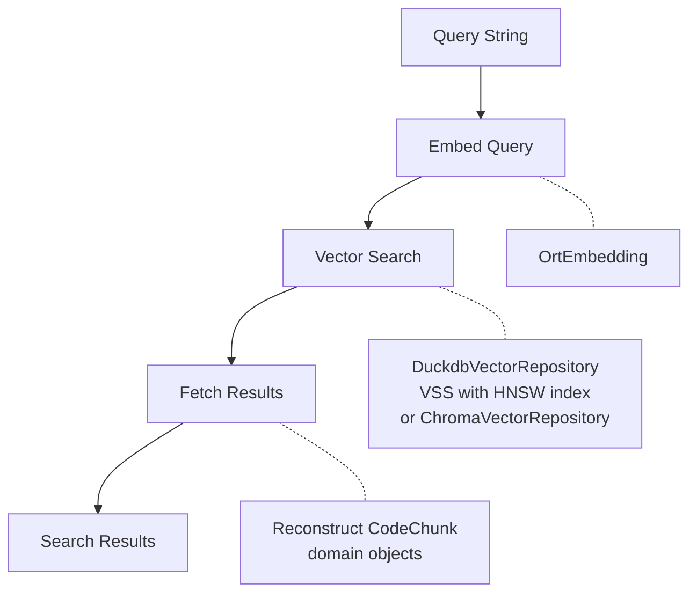

# Architecture Overview

CodeSearch follows Domain-Driven Design (DDD) principles with a clean separation of concerns.

## Layer Structure

## Layers

### CLI Layer (`src/main.rs`)

The command-line interface that users interact with. Responsible for:
- Parsing command-line arguments
- Initializing dependencies (wiring adapters to use cases)
- Formatting and displaying output

### Application Layer (`src/application/`)

Contains use cases and interface definitions (ports):

**Use Cases** (`src/application/use_cases/`):
- **IndexRepositoryUseCase**: Indexes a code repository
- **SearchCodeUseCase**: Performs semantic search
- **ListRepositoriesUseCase**: Lists indexed repositories
- **DeleteRepositoryUseCase**: Removes a repository from the index

**Interfaces/Ports** (`src/application/interfaces/`):
- **VectorRepository**: Interface for vector storage and similarity search operations
- **MetadataRepository**: Interface for repository metadata persistence
- **EmbeddingService**: Interface for generating embeddings from text
- **ParserService**: Interface for parsing code and extracting code chunks

### Domain Layer (`src/domain/`)

Pure domain objects with encapsulated behavior. All fields are private with accessor methods.

**Models** (`src/domain/models/`):
- **CodeChunk**: Represents a parsed code segment with domain methods like `line_count()`, `is_callable()`, `qualified_name()`, `preview()`
- **Repository**: Represents an indexed repository with methods like `is_indexed()`, `average_chunks_per_file()`, `summary()`
- **Embedding**: Vector representation with methods like `is_normalized()`, `magnitude()`, `cosine_similarity()`
- **SearchResult/SearchQuery**: Search-related value objects with relevance checking and filter methods
- **Language**: Programming language enum with methods like `is_known()`, `primary_extension()`, `uses_braces()`

**Error** (`src/domain/error.rs`):
- **DomainError**: Unified error type with helper methods like `is_not_found()`, `is_storage_error()`

### Connector Layer (`src/connector/`)

Implements the application interfaces with concrete adapters:

**Adapters** (`src/connector/adapter/`):
- **DuckdbMetadataRepository**: DuckDB implementation of MetadataRepository; stores repository metadata, chunks, and statistics
- **DuckdbVectorRepository**: DuckDB implementation of VectorRepository with VSS (Vector Similarity Search) acceleration using HNSW indexes and cosine distance
- **ChromaVectorRepository**: ChromaDB implementation of VectorRepository for remote vector storage
- **InMemoryVectorRepository**: In-memory implementation of VectorRepository for testing/ephemeral indexing
- **OrtEmbedding**: ONNX Runtime implementation of EmbeddingService using sentence-transformers models
- **MockEmbedding**: Mock implementation of EmbeddingService for testing
- **TreeSitterParser**: Tree-sitter based implementation of ParserService for multi-language code parsing

## Data Flow

### Indexing Flow

### Search Flow

## Design Decisions

### Why DDD with Ports & Adapters?

- **Clear separation**: Domain logic is isolated from infrastructure
- **Testability**: Easy to test with mock adapters
- **Flexibility**: Easy to swap implementations (e.g., different vector databases)
- **Dependency Inversion**: High-level modules don't depend on low-level modules

### Interface Location (Application Layer)

Following the Ports & Adapters pattern, interfaces (ports) are defined in the Application layer:
- Use cases depend on interfaces they own
- Adapters implement these interfaces
- Domain remains pure with no external dependencies

### Domain Objects with Behavior

Domain models encapsulate both data and behavior:
- Private fields with accessor methods
- `reconstitute()` factory for adapter use
- Domain-specific methods (e.g., `CodeChunk::is_callable()`, `Embedding::cosine_similarity()`)

### Why Tree-sitter?

- Fast, incremental parsing
- Multi-language support
- Produces concrete syntax trees
- Battle-tested in many editors

### Why ONNX Runtime?

- Rust-native embedding generation
- High-performance inference
- Supports multiple embedding models
- No Python dependency required

### Why ChromaDB?

- Purpose-built for embeddings
- Simple HTTP API
- Supports persistence
- Easy to deploy
