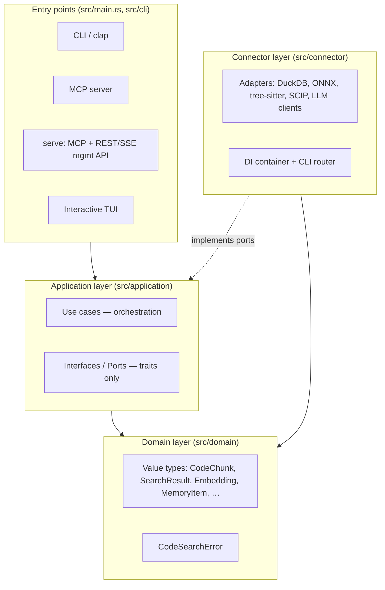
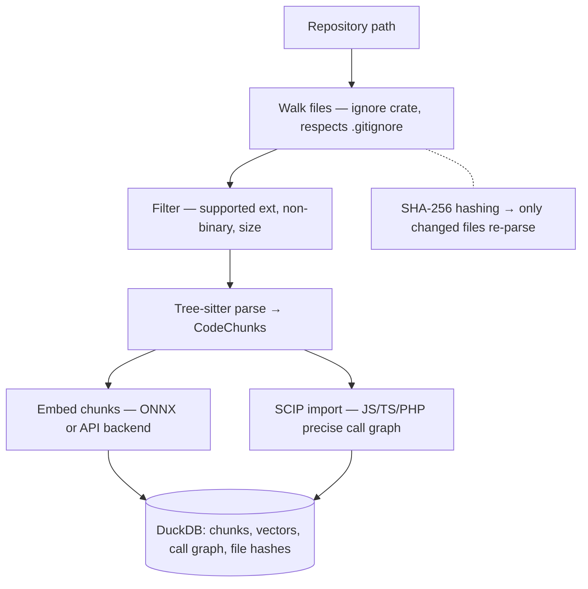
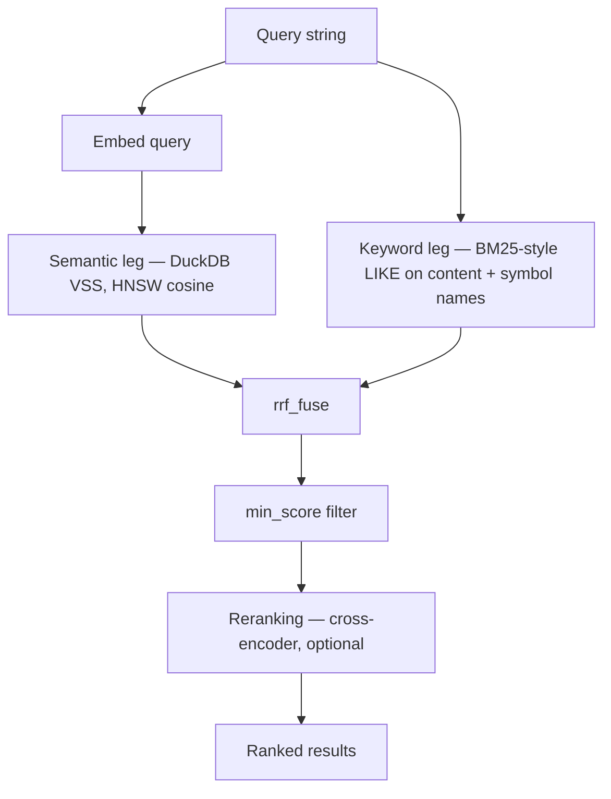

# Architecture Overview

CodeSearch is a single Rust binary built with **Domain-Driven Design (DDD)** and
a strict **Ports & Adapters** (Hexagonal) layering. Dependencies always point
inward: outer layers depend on inner layers, never the reverse.

```mermaid
graph TB
    subgraph Entry["Entry points  (src/main.rs, src/cli)"]
        CLI[CLI / clap]
        MCP[MCP server]
        SERVE[serve: MCP + REST/SSE mgmt API]
        TUI[Interactive TUI]
    end

    subgraph App["Application layer  (src/application)"]
        UC[Use cases — orchestration]
        Ports[Interfaces / Ports — traits only]
    end

    subgraph Domain["Domain layer  (src/domain)"]
        Models[Value types: CodeChunk, SearchResult, Embedding, MemoryItem, …]
        Err[CodeSearchError]
    end

    subgraph Conn["Connector layer  (src/connector)"]
        Adapters[Adapters: DuckDB, ONNX, tree-sitter, SCIP, LLM clients]
        DI[DI container + CLI router]
    end

    Entry --> App
    App --> Domain
    Conn -.->|implements ports| App
    Conn --> Domain
```

## Layers at a glance

| Layer | Path | Responsibility |
|---|---|---|
| **Domain** | `src/domain/` | Pure value types and the unified `CodeSearchError`. No I/O, no async, no external crates beyond `serde`. |
| **Application** | `src/application/` | Use cases (orchestration) and port traits (`VectorRepository`, `EmbeddingService`, `ChatClient`, `MemoryRepository`, …). Depends only on Domain. |
| **Connector** | `src/connector/` | Concrete adapters, the dependency-injection container, the CLI router, the MCP server, and the management API. Depends on Application + Domain. |
| **Entry points** | `src/main.rs`, `src/cli/` | `clap` command definitions; parse flags, wire logging, and delegate to the Router. |

Why this layering: domain logic stays isolated from infrastructure, adapters
are trivially swappable (a different vector store, a different LLM backend), and
tests exercise the full pipeline with in-memory/mock adapters and no network.

## Application layer

### Use cases (`src/application/use_cases/`)

Search & indexing:

- **IndexRepositoryUseCase** — walk, parse, embed, and persist a repository.
- **SearchCodeUseCase** — hybrid search: a semantic (vector) leg and a keyword
  (BM25-style) leg, fused via RRF, then optionally reranked.
- **rrf_fuse** — Reciprocal Rank Fusion of two ranked lists (`1/(60+rank)` per
  leg, summed).
- **ListRepositoriesUseCase** / **DeleteRepositoryUseCase** — repository
  management; **SnippetLookupUseCase** — source-chunk retrieval.

Call graph & explanation:

- **CallGraphUseCase** — tracks and queries symbol references (callers,
  callees, imports, inheritance, tests, cross-repo).
- **ImpactAnalysisUseCase** — BFS outward from a symbol to compute its blast
  radius.
- **SymbolContextUseCase** — inbound callers + outbound callees fetched in
  parallel, for a 360° view.
- **ExplainUseCase** — assembles a symbol's context + source snippets and asks
  an LLM to describe its purpose, data/control flow, and business feature.

Architecture analysis:

- **ExecutionFeaturesUseCase** — discovers entry-point call chains and scores
  them by criticality.
- **ClusterDetectionUseCase** / **SymbolClusterDetectionUseCase** — Leiden
  community detection over the file graph and the symbol call graph.
- **CouplingDetectionUseCase** — filter-then-verify search for the element that
  glues a fragile community together.
- **FileRelationshipUseCase** — file- and cross-repo dependency graph (`uses`).
- **RepositoryOverviewUseCase** — combines every analysis into one dossier.

Long-term memory:

- **memory_extraction** / **import_session** — parse a transcript, prefetch
  related memories, extract upsert/delete operations via an LLM, apply them.
- **memory_summary** — the L0/L1 virtual-filesystem layer and the whole-memory
  digest.
- **memory_search** — hybrid recall with RRF.
- **memory_dream** — the global consolidation cycle (harvest → consolidate →
  reflect → synthesize skills → refresh).

### Ports (`src/application/interfaces/`)

Trait boundaries the use cases depend on, implemented by connector adapters:
`VectorRepository`, `MetadataRepository`, `CallGraphRepository`,
`FileHashRepository`, `EmbeddingService`, `RerankingService`, `ParserService`,
`ChatClient`, and `MemoryRepository`. All are `#[async_trait]`.

## Domain layer (`src/domain/`)

Pure value objects with encapsulated behaviour (private fields, accessor
methods, a `reconstitute()` factory for adapters):

- **CodeChunk** — a parsed code segment (`line_count()`, `is_callable()`,
  `qualified_name()`, `preview()`).
- **Repository** — an indexed repository (`is_indexed()`, `summary()`).
- **Embedding** — a vector (`is_normalized()`, `magnitude()`,
  `cosine_similarity()`).
- **SearchResult / SearchQuery** — search value objects with relevance and
  filter helpers.
- **Language** — the supported-language enum (`primary_extension()`, …).
- **Memory** — `MemoryKind`, `MemoryItem`, `SessionTranscript`, `MemoryNode`,
  and the operation types.
- **CodeSearchError** — the unified `thiserror` error enum.

## Connector layer (`src/connector/`)

### Adapters (`src/connector/adapter/`)

- **DuckDB** (`adapter/duckdb/`, `duckdb_*.rs`) — metadata, vectors (HNSW /
  cosine via the VSS extension), the call graph, and file hashes. Plus the
  separate `duckdb_memory_repository.rs` for `memory.duckdb`.
- **ONNX Runtime** (`adapter/ort/`) — `OrtEmbedding` (sentence-transformers)
  and `OrtReranking` (cross-encoder).
- **tree-sitter** (`adapter/tree_sitter*`) — multi-language AST parsing and
  chunk extraction; also drives channel-endpoint detection.
- **SCIP** (`adapter/scip/`) — imports precise call graphs from `scip-typescript`
  (JS/TS) and `scip-php` (PHP), giving those languages full caller/callee edges
  beyond tree-sitter heuristics.
- **LLM clients** — `AnthropicClient` and `OpenAiChatClient` (shared by the
  OpenAI-compatible and GitHub Copilot backends) behind the `ChatClient` port,
  plus `copilot_auth.rs` for the Copilot OAuth device flow.
- **MCP server** (`adapter/mcp/`) — the Model Context Protocol server (stdio +
  HTTP) exposing 18 tools.
- **Management API** (`adapter/management/`) — the REST/JSON + SSE server and
  the background memory-dream scheduler started by `serve`.
- **InMemoryVectorRepository** / **MockEmbedding** — deterministic test doubles.

### Wiring (`src/connector/api/`)

- `container.rs` — the dependency-injection container; wires every adapter to
  its port and builds the use-case objects. Register new adapters/use cases
  here.
- `router.rs` — maps CLI commands to use cases and formats output.

## Data flow

### Indexing

```mermaid
flowchart TB
    A[Repository path] --> B[Walk files — ignore crate, respects .gitignore]
    B --> C[Filter — supported ext, non-binary, size]
    C --> D[Tree-sitter parse → CodeChunks]
    D --> E[Embed chunks — ONNX or API backend]
    D --> F[SCIP import — JS/TS/PHP precise call graph]
    E --> G[(DuckDB: chunks, vectors, call graph, file hashes)]
    F --> G

    B -.- B1[SHA-256 hashing → only changed files re-parse]
```

The embedding model, backend, and dimensions are fixed per **namespace** and
recorded in `namespace_config` on first index, then validated on every open —
mismatches are hard errors. The repository's normalized git remote is stored so
later commands can auto-resolve the namespace.

### Search

```mermaid
flowchart TB
    A[Query string] --> B[Embed query]
    A --> D[Keyword leg — BM25-style LIKE on content + symbol names]
    B --> C[Semantic leg — DuckDB VSS, HNSW cosine]
    C --> E[rrf_fuse]
    D --> E
    E --> F[min_score filter]
    F --> G[Reranking — cross-encoder, optional]
    G --> H[Ranked results]
```

The keyword leg and RRF fusion run only when text search is enabled (the CLI
default). `--no-text-search` bypasses them for pure semantic search;
`--no-rerank` skips the reranker.

## Key design decisions

- **DDD + Ports & Adapters** — isolates domain logic, keeps adapters swappable,
  and makes the DI container the single wiring point.
- **Ports live in the Application layer** — use cases own the traits they
  depend on; adapters implement them; the domain stays pure.
- **DuckDB with VSS** — persistent, embedded vector + relational storage with
  HNSW nearest-neighbour search and no external service.
- **tree-sitter + SCIP** — fast incremental multi-language parsing for chunks,
  with SCIP indexers layering precise call graphs onto JS/TS and PHP.
- **ONNX Runtime** — Rust-native, high-performance embedding and reranking
  inference with no Python dependency.
- **One `ChatClient` port, three backends** — OpenAI-compatible, Anthropic, and
  GitHub Copilot are interchangeable for every LLM feature.
