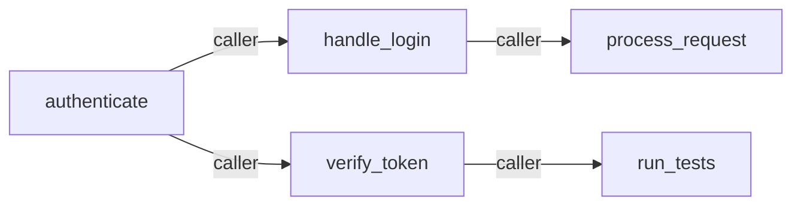

# Call Graph Analysis

CodeSearch builds a call graph during indexing and provides two commands for querying it: **`impact`** for blast-radius analysis and **`context`** for 360-degree symbol dependency views.

## How the Call Graph Works

During `codesearch index`, Tree-sitter extracts function definitions and call-site references from every parsed file. These are stored as `SymbolReference` edges in `DuckdbCallGraphRepository`, recording:

- **caller symbol** — the function/method that contains the call site
- **callee symbol** — the function/method being called
- **reference kind** — e.g., `call`, `type_ref`
- **file path and line** — where the call occurs

The call graph is updated incrementally: only files whose SHA-256 hash has changed are re-parsed on subsequent `index` runs.

## Impact Analysis (`codesearch impact`)

BFS outward from a root symbol through the call graph to find every symbol that would be affected if the root symbol changes.



### Usage

```bash
# Show blast radius of `authenticate` (default depth: 5)
codesearch impact authenticate

# Limit hop depth
codesearch impact authenticate --depth 2

# Restrict to a specific repository
codesearch impact authenticate --repository my-api

# JSON output for scripts
codesearch impact authenticate --format json
```

### Options

| Flag | Default | Description |
|------|---------|-------------|
| `--depth` | `5` | Maximum BFS hop depth (1 = direct callers only) |
| `-r, --repository` | (none) | Restrict the graph traversal to one repository |
| `-F, --format` | `text` | Output format: `text` or `json` |

> `--format vimgrep` is not supported for `impact`.

### Example Text Output

```
Impact analysis for 'authenticate'
─────────────────────────────────────────
Total affected symbols : 4
Max depth reached      : 2

Depth 1 (2 symbol(s)):
  • handle_login [call]  src/api/auth.rs
  • verify_token [call]  src/middleware/auth.rs

Depth 2 (2 symbol(s)):
  • process_request [call]  src/router.rs
  • run_tests [call]  tests/integration.rs
```

### JSON Schema

```json
{
  "root_symbol": "authenticate",
  "total_affected": 4,
  "max_depth_reached": 2,
  "by_depth": [
    [
      { "symbol": "handle_login", "depth": 1, "reference_kind": "call", "file_path": "src/api/auth.rs" }
    ]
  ]
}
```

## Symbol Context (`codesearch context`)

Returns a 360-degree view of a symbol's call-graph relationships — both who calls it (inbound) and what it calls (outbound).

### Usage

```bash
# Show callers and callees of `authenticate`
codesearch context authenticate

# Limit results per direction
codesearch context authenticate --limit 10

# Restrict to a specific repository
codesearch context authenticate --repository my-api

# JSON output
codesearch context authenticate --format json
```

### Options

| Flag | Default | Description |
|------|---------|-------------|
| `--limit` | (none) | Max callers/callees to return per direction |
| `-r, --repository` | (none) | Restrict lookup to one repository |
| `-F, --format` | `text` | Output format: `text` or `json` |

> `--format vimgrep` is not supported for `context`.

### Example Text Output

```
Context for 'authenticate'
─────────────────────────────────────────

Callers (2 total) — who uses this symbol:
  ← handle_login [call]  src/api/auth.rs:42
  ← verify_session [call]  src/middleware/session.rs:18

Callees (3 total) — what this symbol uses:
  → hash_password [call]  src/crypto/hash.rs:10
  → lookup_user [call]  src/db/users.rs:55
  → generate_token [call]  src/crypto/token.rs:7
```

### JSON Schema

```json
{
  "symbol": "authenticate",
  "callers": [
    { "symbol": "handle_login", "reference_kind": "call", "file_path": "src/api/auth.rs", "line": 42 }
  ],
  "caller_count": 2,
  "callees": [
    { "symbol": "hash_password", "reference_kind": "call", "file_path": "src/crypto/hash.rs", "line": 10 }
  ],
  "callee_count": 3
}
```

## Workflow

A typical refactoring workflow:

```bash
# 1. Find the implementation of the function you want to change
codesearch search "user authentication logic"

# 2. Check the blast radius before touching it
codesearch impact authenticate

# 3. Understand its full dependency picture
codesearch context authenticate

# 4. Re-index after making changes (incremental — only changed files are re-parsed)
codesearch index /path/to/repo
```
