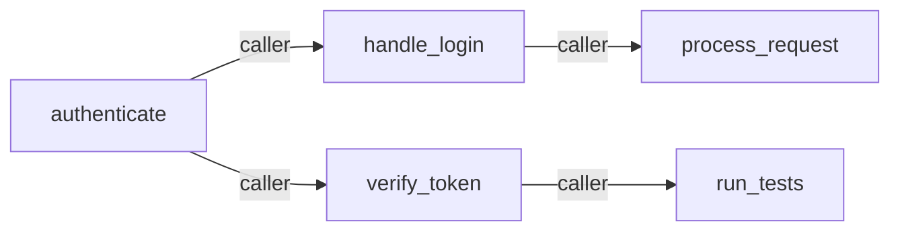

# Call Graph Analysis

CodeSearch builds a call graph during indexing and provides two commands for querying it: **`impact`** for blast-radius analysis and **`context`** for 360-degree symbol dependency views.

## How the Call Graph Works

During `codesearch index`, Tree-sitter extracts function definitions and call-site references from every parsed file. These are stored as `SymbolReference` edges in `DuckdbCallGraphRepository`, recording:

- **caller symbol** — the function/method that contains the call site
- **callee symbol** — the function/method being called
- **reference kind** — e.g., `call`, `type_ref`
- **file path and line** — where the call occurs

The call graph is updated incrementally: only files whose SHA-256 hash has changed are re-parsed on subsequent `index` runs.

## Impact Analysis (`codesearch impact`)

BFS outward from a root symbol through the call graph to find every symbol that would be affected if the root symbol changes.


```mermaid
flowchart LR
    Root["authenticate"] -->|caller| A["handle_login"]
    Root -->|caller| B["verify_token"]
    A -->|caller| C["process_request"]
    B -->|caller| D["run_tests"]
```

### Usage

```bash
# Show blast radius of `authenticate`
codesearch impact authenticate

# Restrict to a specific repository
codesearch impact authenticate --repository my-api

# JSON output for scripts
codesearch impact authenticate --format json

# Vimgrep output (file:line:col:text) for Neovim quickfix
codesearch impact authenticate --format vimgrep

# Match the root symbol with an explicit regex
codesearch impact "^MyNs/.*Service#get$" --regex
```

### Options

| Flag | Default | Description |
|------|---------|-------------|
| `-r, --repository` | (none) | Restrict the graph traversal to one repository |
| `-F, --format` | `text` | Output format: `text`, `json`, or `vimgrep` |
| `--regex` | off | Treat SYMBOL as an explicit POSIX regex (no auto-wrapping) |

> **Symbol matching:** By default the symbol argument is matched as a substring —
> `load` resolves to any fully-qualified name containing `load`. Pass `--regex` to
> control anchoring yourself (e.g. `^MyNs/.*Service#get$`). The same applies to
> `context` and `explain`.

### Example Text Output

```
Impact analysis for 'authenticate'
─────────────────────────────────────────
process_request [call]  src/router.rs:10
└── handle_login [call]  src/api/auth.rs:42
    └── authenticate

run_tests [call]  tests/integration.rs:5
└── verify_token [call]  src/middleware/auth.rs:18
    └── authenticate
```

### JSON Schema

```json
{
  "root_symbol": "authenticate",
  "total_affected": 4,
  "max_depth_reached": 2,
  "by_depth": [
    [
      { "symbol": "handle_login", "depth": 1, "reference_kind": "call", "file_path": "src/api/auth.rs" }
    ]
  ]
}
```

## Symbol Context (`codesearch context`)

Returns a 360-degree view of a symbol's call-graph relationships — both who calls it (inbound) and what it calls (outbound).

### Usage

```bash
# Show callers and callees of `authenticate`
codesearch context authenticate

# Restrict to a specific repository
codesearch context authenticate --repository my-api

# JSON output
codesearch context authenticate --format json

# Vimgrep output (file:line:col:text) for Neovim quickfix
codesearch context authenticate --format vimgrep

# Match the symbol with an explicit regex
codesearch context ".*Repository.*" --regex
```

### Options

| Flag | Default | Description |
|------|---------|-------------|
| `-r, --repository` | (none) | Restrict lookup to one repository |
| `-F, --format` | `text` | Output format: `text`, `json`, or `vimgrep` |
| `--regex` | off | Treat SYMBOL as an explicit POSIX regex (no auto-wrapping) |

### Example Text Output

The output renders caller chains as trees (top-most entry point first, queried symbol at the bottom), with callees hanging off the queried symbol:

```
Context for 'authenticate'
─────────────────────────────────────────
process_request [call]  src/router.rs:10
└── handle_login [call]  src/api/auth.rs:42
    └── authenticate
        ├── hash_password [call]  src/crypto/hash.rs:10
        ├── lookup_user [call]  src/db/users.rs:55
        └── generate_token [call]  src/crypto/token.rs:7

verify_session [call]  src/middleware/session.rs:18
└── authenticate
    ├── hash_password [call]  src/crypto/hash.rs:10
    ├── lookup_user [call]  src/db/users.rs:55
    └── generate_token [call]  src/crypto/token.rs:7
```

### JSON Schema

```json
{
  "symbol": "authenticate",
  "root_symbols": ["MyModule::authenticate"],
  "callers_by_depth": [
    [{ "symbol": "handle_login", "depth": 1, "reference_kind": "call", "file_path": "src/api/auth.rs", "line": 42 }]
  ],
  "total_callers": 2,
  "max_caller_depth": 2,
  "callees_by_depth": [
    [{ "symbol": "hash_password", "depth": 1, "reference_kind": "call", "file_path": "src/crypto/hash.rs", "line": 10 }]
  ],
  "total_callees": 3,
  "max_callee_depth": 1
}
```

## LLM Explanation (`codesearch explain`)

Uses an LLM to produce a natural-language explanation of a symbol's complete call flow, data flow, and business purpose. It runs the same context analysis as `codesearch context`, collects source snippets for every symbol in the call chain, and sends everything to the configured LLM backend (default `open-ai`; see [LLM backends](../../AGENTS.md#llm-backends)).

The LLM response is structured into four sections:

- **Purpose** — what the symbol does and why it exists
- **Data and control flow** — a hop-by-hop breakdown of every caller path and callee
- **Business feature** — the end-to-end user-visible capability the call chain implements
- **Key patterns and dependencies** — notable abstractions, external services, or design patterns

### Usage

```bash
# Explain `authenticate` using the default backend (open-ai — a local
# OpenAI-compatible endpoint such as LM Studio)
codesearch explain authenticate

# Use the Anthropic-compatible backend, or a GitHub Copilot subscription
codesearch explain authenticate --llm anthropic
codesearch explain authenticate --llm copilot

# Restrict to a specific repository
codesearch explain authenticate --repository my-api

# Also print every analyzed symbol and the source chunk sent to the LLM
codesearch explain authenticate --dump-symbols

# Use a regex to match the symbol name
codesearch explain ".*authenticate.*" --regex
```

### Options

| Flag | Default | Description |
|------|---------|-------------|
| `--llm` | `open-ai` | LLM backend: `open-ai` (default), `anthropic`, or `copilot` |
| `-r, --repository` | (none) | Restrict analysis to one repository |
| `--dump-symbols` | off | Print each analyzed symbol's source chunk after the explanation |
| `--regex` | off | Treat SYMBOL as an explicit regex (no auto-wrapping) |

### Environment Variables

The `open-ai` backend defaults to a local endpoint (LM Studio on
`http://localhost:1234`) and can also be configured with `codesearch openai …`.
See [AGENTS.md — LLM backends](../../AGENTS.md#llm-backends) for the complete
backend and configuration reference.

| Variable | Backend | Description |
|----------|---------|-------------|
| `OPENAI_BASE_URL` | `open-ai` | API base URL (default: `http://localhost:1234`) |
| `OPENAI_MODEL` | `open-ai` | Model name |
| `OPENAI_API_KEY` | `open-ai` | API key (any non-empty value for local servers) |
| `ANTHROPIC_BASE_URL` | `anthropic` | API base URL (default: Anthropic cloud) |
| `ANTHROPIC_MODEL` | `anthropic` | Model name |
| `ANTHROPIC_API_KEY` | `anthropic` | API key for Anthropic |

### Example Output

```text
Explanation for `authenticate`
════════════════════════════════════════════════════════════

## Purpose
authenticate validates user credentials by looking up the account, verifying
the password hash, and issuing a session token. The caller chain shows it is
the central gate called by both the web handler and the CLI login flow.

## Data and control flow
• `handle_login` → `authenticate`
  - Extracts username and password from the HTTP request body.
  - Calls authenticate(username, password) and returns 401 on failure.
• `authenticate` → `lookup_user`
  - Queries the user store by username; returns Err if not found.
• `authenticate` → `verify_password`
  - Passes the stored hash and the plaintext candidate to verify_password.
• `authenticate` → `generate_token`
  - On success, generates a signed JWT and returns it to the caller.

## Business feature
The chain implements the login endpoint exposed by handle_login. A client
POSTs credentials; authenticate is the integrity gate that verifies identity
before any session token is issued.

## Key patterns and dependencies
• `argon2` (argon2 crate) — used by `verify_password`
  - Memory-hard password hashing algorithm.
  - Protects stored credentials against brute-force attacks.

---
Analysed 4 symbols across 2 call levels.

## Referenced files
- `my-api` src/api/auth.rs:42 — `handle_login`
- `my-api` src/auth/mod.rs:10 — `authenticate`
- `my-api` src/db/users.rs:55 — `lookup_user`
```

## Workflow

A typical refactoring workflow:

```bash
# 1. Find the implementation of the function you want to change
codesearch search "user authentication logic"

# 2. Check the blast radius before touching it
codesearch impact authenticate

# 3. Understand its full dependency picture
codesearch context authenticate

# 4. Get an LLM-generated explanation of the full call flow
codesearch explain authenticate

# 5. Re-index after making changes (incremental — only changed files are re-parsed)
codesearch index /path/to/repo
```
