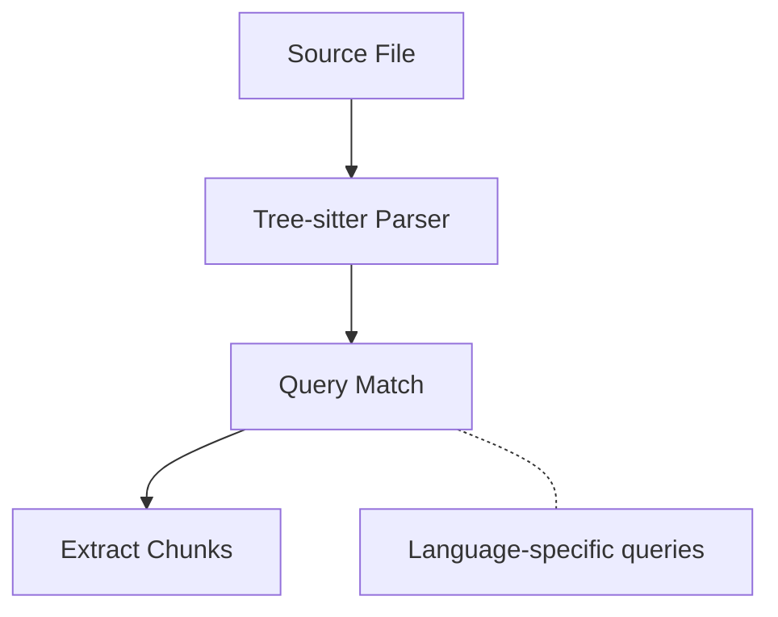

# Indexing Pipeline

## Overview

The indexing pipeline transforms source code into searchable embeddings through the following stages:

1. **Repository Discovery** - Walk the file tree
2. **File Filtering** - Select supported files
3. **AST Parsing** - Extract code chunks
4. **Embedding Generation** - Create vector representations
5. **Persistence** - Store in databases

## Stage Details

### 1. Repository Discovery

Uses the `ignore` crate to walk the repository while respecting:
- `.gitignore` patterns
- Global gitignore
- `.git/info/exclude`

### 2. File Filtering

Files are filtered by:
- Extension (only supported languages)
- Binary detection
- Size limits (configurable)

### 3. AST Parsing

Tree-sitter parses each file and extracts semantic chunks:



#### Extracted Node Types

| Language   | Node Types                                    |
|------------|-----------------------------------------------|
| Rust       | function, struct, enum, trait, impl, module   |
| Python     | function, class                               |
| JavaScript | function, class, method, arrow_function       |
| TypeScript | function, class, method, arrow_function       |
| Go         | function, method, type                        |
| HCL        | block, attribute                              |
| PHP        | function, class, method                       |
| C++        | function, class, struct, method               |

### 4. Embedding Generation

Each chunk is converted to a vector embedding:

```rust
// Chunk preparation
let text = format!("{} [{}] {}",
    symbol_name,  // e.g., "calculate_sum"
    node_type,    // e.g., "function"
    content       // The actual code
);

// Generate embedding
let embedding = model.embed(text);  // 384 dimensions
```

#### Embedding Models

| Model                          | Dimensions | Sequence Length |
|--------------------------------|------------|-----------------|
| mxbai-embed-xsmall-v1 (default) | 384        | 512             |
| bge-small-en-v1.5              | 384        | 512             |

### 5. Persistence

Data is stored using configurable backends:

#### DuckDB (Default)

**Architecture**: Separate adapters handle metadata and vectors with a shared DuckDB connection

**Metadata** (via `DuckdbMetadataRepository`):
- Repository information: ID, name, path, creation/update timestamps
- Code statistics: chunk count, file count
- Storage metadata: vector store type, namespace
- Code chunks: full content, file paths, line numbers, language, node type, symbol names

**Vectors** (via `DuckdbVectorRepository` with VSS):
- Stores FLOAT[384] embedding vectors directly in DuckDB
- **VSS (Vector Similarity Search) acceleration**:
  - Uses HNSW (Hierarchical Navigable Small World) index
  - Cosine distance metric for similarity calculations
  - Fast approximate nearest neighbor search
- Support for multiple namespaces (separate schemas per project/collection)
- Lazy index creation: HNSW index is built on first query

#### ChromaDB (Optional)
Use `--chroma-url` to store vectors in ChromaDB instead:
- Remote vector storage capability
- Persistent collection management
- Metadata storage still uses DuckDB

#### In-Memory (Testing)
Use `--memory-storage` for testing without persistence

## Performance Considerations

### Batch Processing

Embeddings are generated in batches for efficiency:

```rust
// Process files in chunks of 100
for batch in chunks.chunks(100) {
    let embeddings = embedding_service.embed_chunks(batch).await?;
    embedding_repo.save_batch(&embeddings).await?;
}
```

### Incremental Indexing

By default, codesearch uses **hash-based change detection** to avoid re-indexing unchanged files:

1. **SHA-256 content hashing** tracks file changes
2. **Change detection** categorizes files as: added, modified, deleted, or unchanged
3. **Selective processing**: only processes added and modified files
4. **Chunk deletion**: removes chunks for deleted files
5. **Accurate statistics**: tracks deleted chunk counts for correct total updates

#### Usage

```bash
# Incremental index (default)
codesearch index /path/to/repo

# Force full re-index
codesearch index /path/to/repo --force
```

#### Example Output

```
Detected changes: 2 added, 1 modified, 0 deleted, 47 unchanged
Incremental indexing complete: processed 3 files (15 new chunks)
Successfully indexed repository: my-repo (50 files, 486 chunks)
```

#### Performance Impact

| Scenario | Full Index | Incremental |
|----------|-----------|-------------|
| First index (new repo) | ~60s | ~60s |
| All files unchanged | ~60s | <1s |
| 5% of files changed | ~60s | ~3s |

File hashes are stored in a dedicated `file_hashes` table (DuckDB) with PRIMARY KEY on (repository_id, file_path).

## Configuration Options

```rust
pub struct IndexConfig {
    /// Maximum file size to index (bytes)
    pub max_file_size: usize,

    /// Batch size for embedding generation
    pub batch_size: usize,

    /// Minimum chunk size (characters)
    pub min_chunk_size: usize,

    /// Maximum chunk size (characters)
    pub max_chunk_size: usize,
}
```

## Error Handling

The indexing pipeline handles errors gracefully:

- **Parse errors**: Logged and skipped
- **Embedding errors**: Logged and skipped
- **I/O errors**: Logged and skipped
- **Storage errors**: Propagated (fatal)

This ensures partial indexing succeeds even when some files fail.

## Reranking During Search

Optionally, search results can be reranked using a cross-encoder model for improved relevance:

### How Reranking Works

```
User Query
    ↓
Embed Query (384 dimensions)
    ↓
Vector Search (retrieve candidates)
    └─ Fetch num + ⌈num / ln(num)⌉ candidates (defaults to 20 base when num ≤ 10)
    ↓
Filter (exclude candidates with vector score < 0.1)
    ↓
Reranking (mxbai-rerank-xsmall-v1)
    ├─ Score each candidate against query
    ├─ Sort by relevance score
    └─ Keep top num results
    ↓
Return Results
```

### Reranking Model

- **Model**: `mixedbread-ai/mxbai-rerank-xsmall-v1`
- **Type**: Cross-encoder (scores query-document pairs)
- **Size**: ~70M parameters (ONNX format)
- **Download**: Automatic from HuggingFace Hub (~150MB)

### Usage

```bash
codesearch search "authentication"

# Number of results
codesearch search "error handling" --num 20

# Disable reranking
codesearch search "error handling" --no-rerank
```

### Performance Impact

| Mode | Latency | Quality |
|------|---------|---------|
| Vector search only | 50-200ms | Good |
| + Reranking | 200-800ms | Excellent |

**Recommendation**: use reranking when result quality is more important than speed, especially for specific or complex queries.
