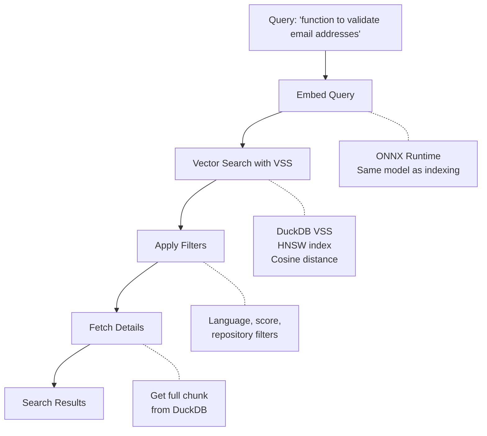

# Search Features

## Overview

CodeSearch uses semantic similarity to find relevant code. Unlike keyword search, it understands the meaning of your query and finds conceptually similar code.

## How It Works



**Search Pipeline**:
1. **Query Embedding**: Input text is embedded using the same model as indexing (384 dimensions)
2. **VSS Search**: DuckDB's Vector Similarity Search uses HNSW index to find similar vectors (fast approximate nearest neighbors)
3. **Filtering**: Results filtered by language, node type, repository, and minimum score threshold
4. **Reranking**: Enabled by defaylt, skip using `--no-rerank`
5. **Details Fetch**: Full code chunks reconstructed from DuckDB
6. **Ranking**: Results ranked by cosine distance (0.0 = opposite, 1.0 = identical) or reranking score if enabled

## Search Query Options

### Basic Search

```bash
codesearch search "parse configuration file"
```

### Result Limit

```bash
# Get top 20 results
codesearch search "error handling" --num 20
```

### Reranking for Better Relevance

Enable cross-encoder reranking to improve result quality:

```bash
# Basic reranking (fetches ~27 candidates via inverse-log scaling, returns top 10)
codesearch search "error handling"

# Reranking with custom result count
codesearch search "validation" --num 20

# No reranking
codesearch search "validation" --no-rerank
```

**How reranking works:**
- Fetches candidates from vector search using an inverse-log formula: `num + ⌈num / ln(num)⌉` (defaults to 20 base candidates when `num ≤ 10`)
- Filters out candidates with a vector similarity score below 0.1 (too irrelevant to benefit from reranking)
- Rescores remaining candidates using a cross-encoder model (mxbai-rerank-xsmall-v1)
- Returns top `num` results by relevance score

**Trade-offs:**
- ✅ Better result relevance (especially for specific queries)
- ✅ No external dependencies or APIs
- ✅ Logarithmic candidate scaling keeps reranking fast even for large result counts

### Minimum Score Threshold

Filter out low-confidence matches:

```bash
# Only show results with score >= 0.5
codesearch search "database query" --min-score 0.5
```

### Language Filter

```bash
# Only search Rust code
codesearch search "async function" --language rust

# Multiple languages
codesearch search "http client" --language rust --language python
```

### Repository Filter

```bash
# Search specific repository
codesearch search "authentication" --repository abc123
```

## Output Formats

Use `-F` / `--format` to control the output format:

```bash
codesearch search "validate email" --format text    # default
codesearch search "validate email" --format json    # structured JSON
codesearch search "validate email" --format vimgrep # Neovim-compatible
```

### Text (default)

```text
Found 3 results:

1. src/auth/validator.rs:42-58 (score: 0.847)
   Symbol: validate_email (function)
   | pub fn validate_email(email: &str) -> bool {
   |     let re = Regex::new(r"^[^@]+@[^@]+\.[^@]+$").unwrap();
   |     re.is_match(email)

2. src/user/registration.rs:15-32 (score: 0.723)
   Symbol: check_email_format (function)
   | fn check_email_format(input: &str) -> Result<(), ValidationError> {
   |     if !input.contains('@') {
   |         return Err(ValidationError::InvalidEmail);

3. tests/validation_tests.rs:8-25 (score: 0.651)
   Symbol: test_email_validation (function)
   | #[test]
   |  fn test_email_validation() {
   |     assert!(validate_email("user@example.com"));
```

### JSON

Returns a JSON array of result objects, useful for scripts and editor integrations (e.g., the Telescope extension):

```json
[
  {
    "file_path": "src/auth/validator.rs",
    "start_line": 42,
    "end_line": 58,
    "score": 0.847,
    "language": "rust",
    "node_type": "function",
    "symbol_name": "validate_email",
    "content": "pub fn validate_email(email: &str) -> bool { ... }"
  }
]
```

### Vimgrep

Outputs `file:line:col:text` format, directly loadable into Neovim's quickfix list:

```text
src/auth/validator.rs:42:1:[0.847] validate_email - pub fn validate_email(email: &str) -> bool {
src/user/registration.rs:15:1:[0.723] check_email_format - fn check_email_format(input: &str) -> Result<(), ValidationError> {
```

```bash
# Open results in Neovim's quickfix list
codesearch search "validate email" --format vimgrep | nvim -q /dev/stdin
```

## Search Quality Tips

### Be Descriptive

```bash
# Good - describes the intent
codesearch search "function that connects to PostgreSQL database"

# Less effective - too generic
codesearch search "database"
```

### Include Context

```bash
# Good - includes what the code should do
codesearch search "middleware that handles authentication tokens"

# Good - describes the behavior
codesearch search "recursive function to traverse directory tree"
```

### Use Domain Language

```bash
# If your codebase uses specific terminology
codesearch search "CustomerOrder aggregate root validation"
```

## Similarity Scoring

Scores range from 0.0 to 1.0
